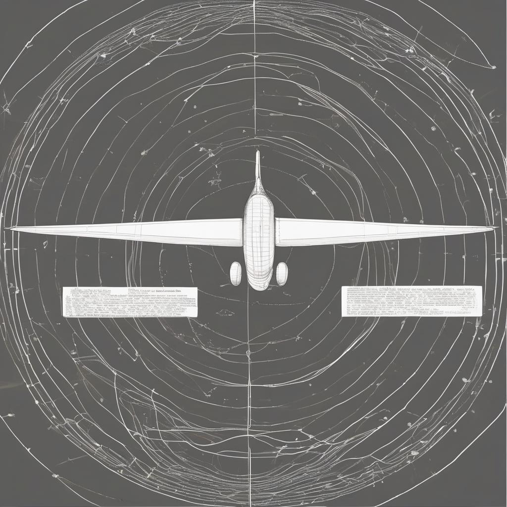

  
_by Martin Ouimet <mart@ibrain.one>_  

The airplane illustrates a powerful and accessible way to understand how perspective shapes our perception of reality, especially in the context of quantum mechanics. Let's distill this concept into a structured explanation:

# Conceptual Explanation: "Perspective and Perceived Reality"
The core of your idea is that reality is consistent and governed by the same laws, but our perception of it can vary dramatically based on our perspective.
Illustration Using the Airplane Example:

## Observation from a Distance (Plane in the Sky):

Scenario: When observing a plane high in the sky, it appears to move slowly.
Explanation: This is due to the observer's perspective, where the vastness of the sky makes the plane's movement seem slow.
Analogy to Quantum Mechanics: Similar to observing quantum phenomena without precise tools, where the subtleties and nuances might not be apparent.
Observation from Up Close (Plane on Tarmac):

Scenario: The same plane on the tarmac, observed up close during takeoff, appears to move very fast.
Explanation: Here, the observer's perspective is narrowed, and the plane's speed is more apparent.
Analogy to Quantum Mechanics: Analogous to observing quantum phenomena with precise measurement tools, revealing different aspects of the phenomena.
Key Takeaway:

Consistent Reality, Different Perspectives: The plane's speed is constant in both scenarios, but the observer's perspective changes the perception of that speed. Similarly, in quantum mechanics, the underlying reality is consistent, but different observational perspectives can reveal different aspects of that reality.
Broader Implications:

This concept underscores the idea that while physical laws are consistent, our understanding and perception of phenomena can vary greatly based on our perspective and the tools we use to observe them.
Application in Quantum Mechanics:

In quantum mechanics, this principle can be particularly striking, as the act of observation itself (not just the perspective) can appear to alter the state of the system being observed.
Conclusion:

Understanding the role of perspective is crucial in interpreting observations, both in everyday life and in the realm of quantum mechanics. It reminds us that our perception of reality is not just a passive reception of information but is actively shaped by our viewpoint and context.
This approach provides a clear and intuitive way to communicate a complex concept, making it accessible to a broader audience and encouraging a deeper appreciation of the subtleties involved in observing and understanding the world around us