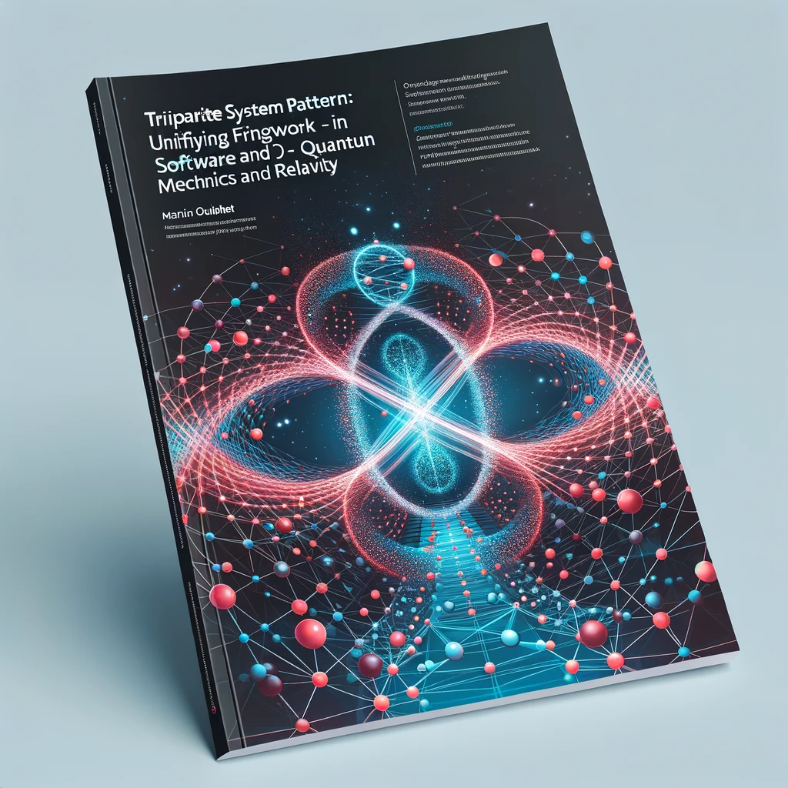

# The Observer's Lens: A Tripartite Perspective on Quantum Mechanics and Relativity
## Author: Martin Ouimet, mouimet@infinisoft.world

## Abstract:

This article proposes a novel thought, "The Observer's Lens," based on the principles of the Tripartite Pattern discovered by the author and employed another use case trying to demonstrate a proof of concept in a novel Brain Inspired Software Architecture. That being said, that pattern seems to be plausible eveyrwhere. Let's think about the idea that the discrepancies between quantum mechanics and Einstein's theory of relativity may stem not from fundamental incompatibilities, but from the differences in observation scales and the observer's interaction with the system. The idea aims to offer a unifying perspective, drawing parallels between the micro, meso, and macro scales in software design and the scales of observation in physics.

## Introduction:

Physics, in its quest to understand the universe, has long grappled with reconciling the seemingly divergent realms of quantum mechanics and Einstein's theory of relativity. Quantum mechanics, governing the micro-world of particles, exhibits phenomena that defy classical intuition, while general relativity elegantly explains the macro-world of gravity and spacetime curvature. The dichotomy between these two realms has persisted as a central puzzle in modern physics.

## The Tripartite System Law in Software Architecture:

In the field of software architecture, the Tripartite System Law is a principle used to manage complexity in systems. It divides a system into three layers - micro, meso, and macro - each with distinct roles and modes of interaction. At the micro-level, systems exhibit behaviors that are not apparent or relevant at the macro scale, and vice versa. This encapsulation and abstraction allow for efficient system design and operation.

## Application to Physics:

The Tripartite System Law can be applied as a metaphorical lens to view the differences between quantum mechanics and relativity. At the quantum (micro) level, the act of observation significantly impacts the system's state, a phenomenon not observed in the macro world of relativity. This difference in how observation affects the system at different scales could be key to understanding the apparent incompatibilities between the two theories.

## Russian Doll

The apparent disparities between the realms of quantum mechanics and Einstein's theory of relativity may not necessarily be rooted in irreconcilable contradictions but rather in the intricate interplay of observation scales and the observer's dynamic relationship with the system.

The central thesis of this idea revolves around the notion that both in the realm of software design and in the realm of physics, the act of observation and perspective plays a pivotal role in shaping our understanding of reality. It draws compelling parallels between the micro, meso, and macro scales within software architecture and the varying scales of observation within the domain of physics.

In essence, the idea underscores the concept that perspective is akin to a Russian doll, systematically abstracting and simplifying details depending on the observer's vantage point. While these perspectives may reveal seemingly conflicting aspects, they fundamentally adhere to the same governing laws. This dynamic gives rise to the intriguing perception of incompatibility, which, upon closer examination, can be traced back to the perspective of the observer.

Ultimately, this idea gives a potential answer to the profound influence of the observer's perspective on the rules governing a system, emphasizing that the observer has the capacity to shape their own version of reality within the bounds of the system's underlying principles. While this phenomenon may appear trivial, it carries profound implications for both software architecture and the foundations of physics, inviting a fresh and unifying perspective on the nature of reality.

## Discussion:

**Quantum Mechanics (Micro Scale)**: In the realm of Quantum Mechanics, specifically at the micro scale, particles exist in states of superposition, characterized by probabilistic descriptions. Notably, the act of measurement serves as a transformative force, collapsing these intricate probabilities—an inherent feature of the microcosm in quantum physics. An intriguing parallel can be drawn here with the micro-level interactions within a software system, where minute and granular interactions exert a profound influence on the overall system state.

Upon these principles, we can offer an explanation for the peculiar phenomena observed in quantum physics, such as particles seemingly occupying multiple positions simultaneously. It is as if our current observational capabilities, limited by scale, prevent us from perceiving the intricate nuances of these particles and their deterministic positions. Quantum physics predictions hold true, but only when our observational vantage point aligns with the scale appropriate for discerning our desired outcomes.

For instance, consider the analogy of observing a rotating car wheel. At a certain scale, particularly during moments of rapid acceleration, it may appear motionless to our senses. However, altering the observer's scale of perception unveils an entirely different reality—a reality that remains consistent with the same governing laws but diverges in the eyes of the observer.

This poses a profound question: What is reality? The answer lies in the hands of the observer, who wields the power to construct their own version of reality by selecting the scale from which they choose to observe.

**General Relativity (Macro Scale)**: In contrast, the macro world, as described by relativity, is deterministic and less influenced by observation. Massive objects and spacetime curvature operate under rules that remain consistent irrespective of observation, akin to the macro-level operations in a software architecture.

**The Observer's Role**: The observer in physics, analogous to a system architect in software, defines the rules of interaction and interpretation at each scale. This perspective posits that the observer's influence and the scale of observation are crucial in determining the law governing the system.

## Conclusion:

The Observer's Lens theory suggests that the incompatibility between quantum mechanics and general relativity might be a matter of perspective, influenced by the scale of observation. This perspective encourages a holistic view of the universe, where different scales reveal different aspects of the same underlying reality. Just as in complex software systems, understanding and integration across different scales - micro, meso, and macro - may hold the key to a unified understanding of the physical universe.

This paper offers a fresh perspective on one of physics' most enduring challenges, using analogies from software architecture to propose a potential path towards a unified theory. The Observer's Lens theory underscores the importance of considering the scale of observation and the observer's role in shaping our understanding of the universe and offer a possibility to explain why observation does influence the outcome.