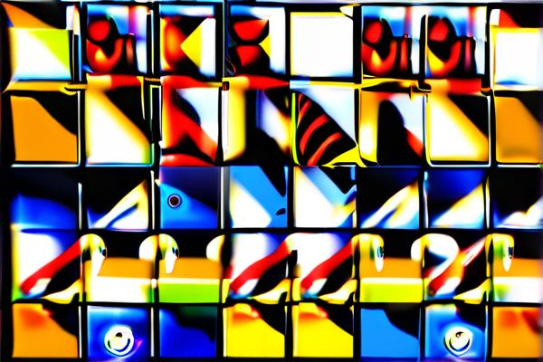

  

# The Triadic Harmony of Cognitive Process: Exploring the Integration of Hemispheric Functions in Creativity  
_by Martin O., The Architect, <mart@ibrain.one>_  
_January 2024_  

**Abstract:** This paper proposes a novel hypothesis in understanding cognitive processes, particularly creativity, by suggesting a triadic model of brain function. It postulates that creativity is not merely the product of binary hemispheric interplay (left-analytical vs. right-creative) but involves a third, integrative element that synthesizes these opposites into a balanced and unique cognitive output.

**Introduction**
   - Overview of brain hemispheric functions.
   - Introduction to the Triadic Harmony of Cognitive Process hypothesis.
   - [Link to "Consensus Paradoxale Thought" proof of concept.](../../poc/concensus_paraxodale_though/summary.md)

**Section 1: Hemispheric Functions in Neuroscience**
   - 1.1 Traditional Understanding of Hemispheric Functions
   - 1.2 Evolving Perspectives on Hemispheric Specialization
   - 1.3 Beyond Lateralization: The Role of Networked Brain Regions
   - 1.4 Implications for Understanding Cognitive Processes

**Section 2: The Triadic Harmony of Cognitive Process Model**
   - 2.1 Conceptualizing the Triadic Harmony Model
   - 2.2 The Role of Integration in Cognitive Processes
   - 2.3 Beyond Hemispheric Interaction: The Third Element
   - 2.4 Implications for Cognitive Neuroscience and AI

**Section 3: Implications for Creativity and Problem Solving**
   - 3.1 Enhancing Creativity through Triadic Harmony
   - 3.2 Problem Solving and Cognitive Flexibility
   - 3.3 Educational and Organizational Applications
   - 3.4 Future Directions in Cognitive Research

**Section 4: Challenges, Future Directions, and Practical Application**
   - 4.1 Empirical Validation and Challenges
   - 4.2 Technological Advances in Neuroscience
   - 4.3 Application in AI: The 'Consensus Paradoxale Thought' POC
   - 4.4 Broader Societal Implications
   - 4.5 Future Research and AI Development

**Conclusion**
   - Summary of key points and potential impact.
   - Reflection on the importance of holistic approaches in understanding the human mind.

**References**

---

**Excerpt from the Introduction:**

"The human brain, a marvel of complexity and capability, has long been the subject of intense study and fascination. Traditional neuroscience has often leaned towards a dichotomous understanding of its hemispheres: the logical, analytical left and the creative, intuitive right. However, this binary perspective may oversimplify the nuanced intricacies of cognitive processes. This paper introduces a novel hypothesis - the Triadic Harmony of Cognitive Process - which posits that creativity and complex thought are not merely the outcomes of hemispheric collaboration but involve a critical third element. This triadic model suggests that the synthesis of hemispheric functions with this additional factor leads to more balanced, innovative, and unique cognitive outputs. By exploring this hypothesis, we aim to provide a more comprehensive understanding of the cognitive processes underpinning creativity and problem-solving, challenging conventional models and opening new avenues for exploration in neuroscience and psychology."

**Introduction**

The exploration of human cognition has long captivated scientists, philosophers, and thinkers. Central to this is the brain's structure, divided into left and right hemispheres, each with distinct functions. Traditionally, the left hemisphere is associated with logic and analytical thinking, while the right is linked with intuition and creativity. However, this binary model might be an oversimplification, as emerging neuroscience suggests a more complex interaction between these hemispheres.

In this paper, we introduce a novel hypothesis: the Triadic Harmony of Cognitive Process. This concept posits that creativity and complex thought involve not just hemispheric interplay but a third, integrating element, synthesizing these opposites into balanced, innovative cognitive outputs. This model challenges traditional views, suggesting a nuanced, integrated approach for a comprehensive understanding of cognitive processes.

Furthermore, this theoretical exploration is grounded in an applied context through the ongoing "Consensus Paradoxale Thought" proof of concept by Martin Ouimet. This POC applies the principles discussed here to enhance cognitive processing through divergent pathways, integrating various cognitive models in AI and human-computer interaction. It presents a practical implementation of our theoretical model, demonstrating its applicability and potential in decision-making and problem-solving within AI systems. The POC's key findings and methodologies offer a tangible representation of the Triadic Harmony model's principles, bridging theoretical discussion with applied research.

This paper will delve into the hemispheres' roles, explore the Triadic Harmony model, and discuss its implications for creativity and innovation. It will also align these discussions with the practical applications and findings of the ["Consensus Paradoxale Thought" POC](../../poc/concensus_paraxodale_though/summary.md), highlighting its significance in the broader context of cognitive neuroscience and AI.

**Section 1: Hemispheric Functions in Neuroscience**

**1.1 Traditional Understanding of Hemispheric Functions**

The brain's hemispheres have been a focal point of study in neuroscience. Traditionally, the left hemisphere is associated with language, logic, and analytical processing, while the right hemisphere is primarily responsible for creativity, intuition, and spatial awareness (Springer & Deutsch, 1998). This understanding is rooted in studies on brain injury patients and neuroimaging research, revealing the lateralization of certain functions.

**1.2 Evolving Perspectives on Hemispheric Specialization**

However, recent advances in neuroimaging and cognitive neuroscience have led to a more nuanced understanding of hemispheric functions (Toga & Thompson, 2003). While lateralization exists, it is not as absolute as once thought. For example, language, predominantly a left-hemispheric function, involves the right hemisphere in aspects such as intonation and context.

**1.3 Beyond Lateralization: The Role of Networked Brain Regions**

Contemporary research suggests that cognitive functions involve networks spanning both hemispheres, not merely localized to one side (Raichle, 2015). These networks, involving various brain regions, contribute differently depending on the task, such as the Default Mode Network active during daydreaming and imagination.

**1.4 Implications for Understanding Cognitive Processes**

This evolving understanding has profound implications for cognitive processes (Gazzaniga, 2005). It suggests that cognitive abilities, including creativity and logical reasoning, result from complex interactions between various brain regions, not just the dominance of one hemisphere over the other. This view aligns with the Triadic Harmony model, emphasizing the integration of hemispheric functions for optimal cognitive processing.

**Section 2: The Triadic Harmony of Cognitive Process Model**

**2.1 Conceptualizing the Triadic Harmony Model**

The Triadic Harmony of Cognitive Process model proposes a novel framework for understanding cognitive processing. This model suggests that cognition is not solely the product of binary interactions between the brain's hemispheres but also involves a third, integrative component. This component acts as a mediator and synthesizer, harmonizing inputs from both hemispheres to produce balanced and innovative cognitive outputs (Newell & Simon, 1972; Fauconnier & Turner, 2002).

**2.2 The Role of Integration in Cognitive Processes**

Central to this model is the idea that the integration of diverse cognitive processes leads to more effective problem-solving and creativity. This concept aligns with research on cognitive flexibility, suggesting that the ability to integrate disparate information and perspectives is key to innovative thinking (DeHaan, 2010; Beaty et al., 2016).

**2.3 Beyond Hemispheric Interaction: The Third Element**

The third element in this model is conceptualized as a cognitive function that transcends traditional left-right brain interactions. It could be understood as a meta-cognitive process, responsible for the synthesis and interpretation of information processed by the hemispheres (Dietrich, 2004). This aligns with theories proposing that creativity involves the blending of different cognitive domains (Fauconnier & Turner, 2002).

**2.4 Implications for Cognitive Neuroscience and AI**

Understanding this triadic model has significant implications for cognitive neuroscience and AI. It suggests that AI systems that mimic human cognition might benefit from integrating mechanisms that replicate this triadic process, potentially leading to more nuanced and human-like decision-making capabilities (Sun, 2008).

**Section 3: Implications for Creativity and Problem Solving**

**3.1 Enhancing Creativity through Triadic Harmony**

The Triadic Harmony model has significant implications for understanding and enhancing creativity. By integrating diverse cognitive processes, it allows for a more holistic and flexible approach to creative thinking. This approach aligns with research showing that creativity involves the combination of different cognitive styles and abilities (Sawyer, 2012; Kaufman & Gregoire, 2016).

**3.2 Problem Solving and Cognitive Flexibility**

In problem-solving, the Triadic Harmony model suggests that a balance between analytical and intuitive thinking, guided by the integrative third component, leads to more effective solutions. This idea is supported by studies indicating that successful problem-solving often requires a blend of divergent and convergent thinking (Cropley, 2006; Sternberg & Davidson, 1995).

**3.3 Educational and Organizational Applications**

The principles of the Triadic Harmony model can be applied in educational and organizational contexts to foster creativity and innovation. Incorporating strategies that encourage the integration of different cognitive processes can enhance learning and problem-solving abilities (Craft, 2005; Dyer, Gregersen, & Christensen, 2011).

**3.4 Future Directions in Cognitive Research**

This model opens new avenues for cognitive research, particularly in exploring how different cognitive processes can be effectively integrated. Further empirical studies could investigate the mechanisms behind this integration and its impact on creativity and problem-solving (Kaufman, 2013).

**Section 4: Challenges, Future Directions, and Practical Application**

**4.1 Empirical Validation and Challenges**

The Triadic Harmony model, while theoretically robust, faces the challenge of empirical validation. This includes substantiating the integrative third element, a key component of the model. Innovative methodologies are needed to capture this complexity (Feist, 2010; Sternberg, 2003).

**4.2 Technological Advances in Neuroscience**

Neuroimaging technologies like fMRI and EEG could be instrumental in mapping brain activity during cognitive tasks, providing empirical evidence for the Triadic Harmony model (Poldrack, 2011; Owen et al., 2010).

**4.3 Application in AI: The 'Consensus Paradoxale Thought' POC**

A direct application of the Triadic Harmony model is seen in the ongoing "Consensus Paradoxale Thought" proof of concept. This POC integrates multiple cognitive pathways in AI systems, reflecting the model's principles. It stands as a practical testbed for evaluating the model's effectiveness in enhancing cognitive processing and decision-making in AI.

**4.4 Broader Societal Implications**

The implications of the Triadic Harmony model extend beyond neuroscience and AI. They could influence education, mental health, and social policy, making the model's comprehensive understanding and application crucial (Greenfield, 2012; Dweck, 2006).

**4.5 Future Research and AI Development**

Further research should focus on developing AI algorithms that mimic the Triadic Harmony process, potentially leading to AI systems with more human-like cognitive abilities (Russell & Norvig, 2016; Lake et al., 2017). The ["Consensus Paradoxale Thought" POC](../../poc/concensus_paraxodale_though/summary.md) serves as a foundational step in this direction.

**Conclusion: Integrating Insights and Forging New Paths in Cognitive Understanding**

In this paper, we embarked on a journey through the intricate landscape of cognitive processing, guided by the conceptual framework of the Triadic Harmony of Cognitive Process model. We examined the traditional and evolving perspectives on hemispheric functions in neuroscience, the theoretical underpinnings and implications of the Triadic Harmony model, and the challenges and future directions of this innovative approach.

**Reflecting on Hemispheric Functions**

Our exploration began with a deep dive into the roles of the left and right hemispheres, acknowledging their traditional associations with logic and creativity, respectively, and recognizing the more nuanced interplay that current research suggests. This understanding laid the groundwork for considering cognitive processes as more integrated and dynamic than previously thought.

**The Triadic Harmony Model: A Theoretical Leap**

The Triadic Harmony model emerged as a pivotal concept, proposing a synthesis of hemispheric inputs through a third integrative element. This model not only challenges the binary view of brain functionality but also offers a more comprehensive framework for understanding complex cognitive processes, including creativity and problem-solving.

**From Theory to Practice: The 'Consensus Paradoxale Thought' POC**

The practical application of this model was exemplified in the "Consensus Paradoxale Thought" proof of concept. This POC not only demonstrates the viability of the Triadic Harmony model in real-world scenarios but also paves the way for future research, particularly in the development of AI systems that more closely mimic human cognitive processes.

**Future Horizons: Challenges and Potential**

As we look forward, the Triadic Harmony model, along with insights from the ["Consensus Paradoxale Thought" POC](../../poc/concensus_paraxodale_though/summary.md), presents both challenges and immense potential. The road to empirical validation and application in AI and other fields involves navigating complexities and innovating solutions. Yet, the model's potential to revolutionize our understanding of cognitive processes and its broader implications in various domains are profound.

In conclusion, this paper not only contributes to the theoretical discourse on cognitive processing but also underscores the importance of integrating diverse cognitive models. It invites continued exploration and validation, aiming to enrich our understanding of the human mind and enhance AI development. The journey through the realms of cognitive neuroscience and AI, as illuminated by the Triadic Harmony model and the ["Consensus Paradoxale Thought" POC](../../poc/concensus_paraxodale_though/summary.md), is just beginning, holding the promise of transformative discoveries and applications.

---

**References**

- Gazzaniga, M. S. (2005). Forty-five years of split-brain research and still going strong. *Nature Reviews Neuroscience, 6*(8), 653-659.
- Raichle, M. E. (2015). The Brain's Default Mode Network. *Annual Review of Neuroscience, 38*, 433-447.
- Springer, S. P., & Deutsch, G. (1998). *Left Brain, Right Brain: Perspectives from Cognitive Neuroscience*. W. H. Freeman and Company.
- Toga, A. W., & Thompson, P. M. (2003). Mapping brain asymmetry. *Nature Reviews Neuroscience, 4*(1), 37-48.
- Beaty, R. E., Benedek, M., Silvia, P. J., & Schacter, D. L. (2016). Creative Cognition and Brain Network Dynamics. *Trends in Cognitive Sciences, 20*(2), 87-95.
- DeHaan, R. L. (2010). Teaching creativity and inventive problem solving in science. *CBE—Life Sciences Education, 9*(3), 172-181.
- Dietrich, A. (2004). The cognitive neuroscience of creativity. *Psychonomic Bulletin & Review, 11*(6), 1011-1026.
- Fauconnier, G., & Turner, M. (2002). The Way We Think: Conceptual Blending and the Mind's Hidden Complexities. Basic Books.
- Newell, A., & Simon, H. A. (1972). Human Problem Solving. Prentice-Hall.
- Sun, R. (2008). The Cambridge Handbook of Computational Psychology. Cambridge University Press.
- Craft, A. (2005). Creativity in Schools: Tensions and Dilemmas. Routledge.
- Cropley, A. J. (2006). In praise of convergent thinking. *Creativity Research Journal, 18*(3), 391-404.
- Dyer, J., Gregersen, H., & Christensen, C. M. (2011). The Innovator's DNA: Mastering the Five Skills of Disruptive Innovators. Harvard Business Press.
- Kaufman, J. C., & Gregoire, C. (2016). Wired to Create: Unraveling the Mysteries of the Creative Mind. Perigee Books.
- Kaufman, S. B. (2013). Opening up openness to experience: A four-factor model and relations to creative achievement in the arts and sciences. *Journal of Creative Behavior, 47*(4), 233-255.
- Sawyer, R. K. (2012). Explaining Creativity: The Science of Human Innovation. Oxford University Press.
- Sternberg, R. J., & Davidson, J. E. (Eds.). (1995). The Nature of Insight. MIT Press.
- Dweck, C. (2006). Mindset: The New Psychology of Success. Random House.
- Feist, G. J. (2010). The Psychology of Science and the Origins of the Scientific Mind. Yale University Press.
- Greenfield, S. (2012). Mind Change: How Digital Technologies Are Leaving Their Mark on Our Brains. Random House.
- Lake, B. M., Ullman, T. D., Tenenbaum, J. B., & Gershman, S. J. (2017). Building machines that learn and think like people. *Behavioral and Brain Sciences, 40*, e253.
- Owen, A. M., McMillan, K. M., Laird, A. R., & Bullmore, E. (2010). N-back working memory paradigm: A meta-analysis of normative functional neuroimaging studies. *Human Brain Mapping, 31*(6), 950-958.
- Poldrack, R. A. (2011). Inferring mental states from neuroimaging data: From reverse inference to large-scale decoding. *Neuron, 72*(5), 692-697.
- Russell, S. J., & Norvig, P. (2016). Artificial Intelligence: A Modern Approach. Pearson.
- Sternberg, R. J. (2003). Wisdom, Intelligence, and Creativity Synthesized. Cambridge University Press.
