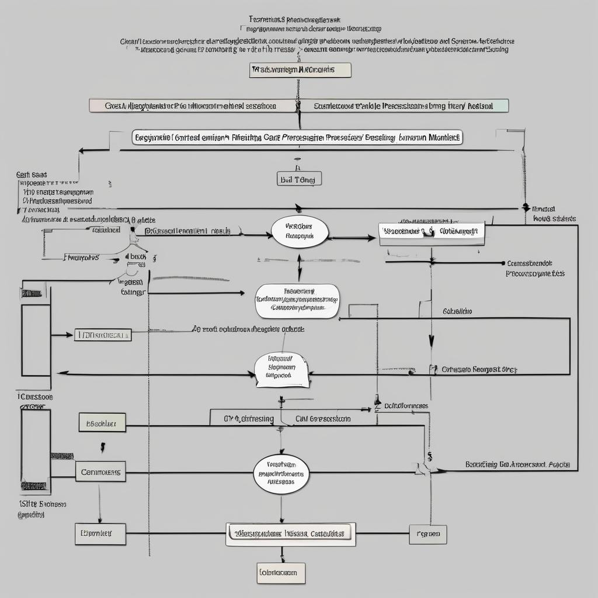

  
_by Martin Ouimet <mart@ibrain.one>_

**Test Plan for Generated Answer From Conscensus of Paradoxale Thoughts**

**Objective:**
To evaluate the efficacy of the integrated cognitive processing model, which synthesizes outcomes from two distinct cognitive pathways (linear-sequential and recall-driven) to enhance decision-making and problem-solving.

**1. Phase 1: Simulations and Controlled Experiments**

- **Purpose:** To test the model in a controlled, risk-free environment using simulated inputs.
- **Method:** Computer simulations will be designed to replicate cognitive processing based on the model. Simulated scenarios will encompass various types of stimuli and problems.
- **Metrics:** Evaluate the coherence, creativity, and comprehensiveness of responses. Measure processing time and cognitive load.

**2. Phase 2: Participant Trials**

- **Purpose:** To test the model with human subjects in real-world scenarios.
- **Selection of Participants:** A diverse group of individuals to ensure a wide range of cognitive styles and thought processes.
- **Method:**
  - Present participants with problems or stimuli.
  - Record their cognitive process using the model.
  - Collect responses for analysis.
- **Metrics:** As with simulations, but also include participant feedback on the process and the perceived effectiveness of their responses.

**3. Data Collection and Analysis**

- **Qualitative Data:** Participant feedback, expert reviews of responses.
- **Quantitative Data:** Response times, consistency of outcomes, cognitive load measurements.
- **Analysis:** Compare data against control groups (if applicable) and assess against predefined metrics.

**4. Iterative Refinement**

- **Feedback Loops:** Use data and feedback to refine the model.
- **Adjustments:** Make necessary changes to the workflow, integration process, or component functionalities based on test results.

**5. Reporting and Documentation**

- **Regular Reporting:** Document findings and insights at each stage of testing.
- **Final Report:** Compile a comprehensive report detailing the test process, findings, and recommendations for the model's future development.

**6. Ethical Considerations and Compliance**

- Ensure all testing, especially with human participants, complies with ethical standards and regulations.
- Obtain necessary approvals and informed consent from participants.

**7. Timeline and Resources**

- Outline a clear timeline for each phase of testing.
- Determine the resources needed, including personnel, technology, and funding.

**8. Risk Management and Contingency Planning**

- Identify potential risks in the testing process and develop contingency plans.

**9. Post-Testing Application and Future Research**

- Plan for potential application areas for the model based on test outcomes.
- Identify avenues for further research.

---

This test plan provides a structured approach to evaluating the integrated cognitive processing model. It balances controlled experimentation with real-world application, ensuring a comprehensive assessment of the model’s effectiveness. Please review this plan and let me know if any modifications are needed.