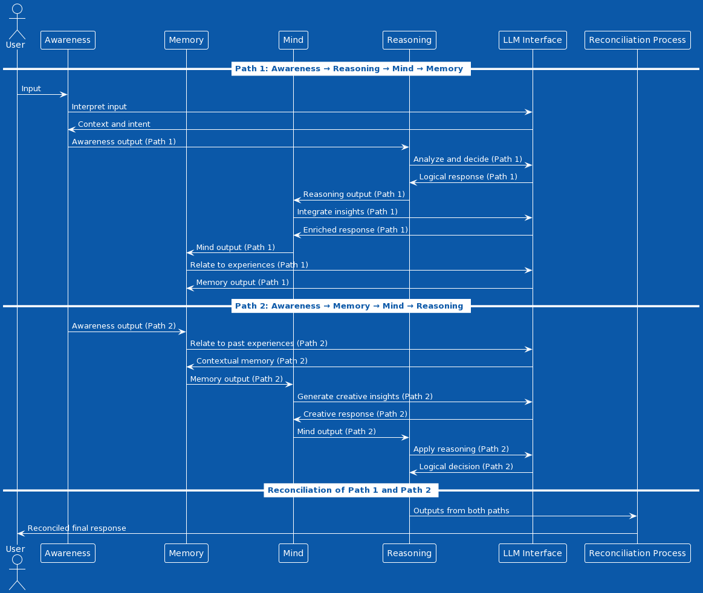

  

# Consensus Paradoxale Thought: Enhancing Cognitive Processing through Divergent Pathways  
_by Martin Ouimet <mart@ibrain.one>_

## Abstract
- **Brief Overview:** Summarize the core idea of integrating different cognitive processing paths and the expected benefits in terms of decision-making and problem-solving.
- **Key Findings:** Highlight the main results or insights from the POC.

## Introduction
- **Background:** Introduce the concept of cognitive processing models and their relevance in AI and human-computer interaction.
- **Problem Statement:** Define the challenges in current cognitive models, such as linear processing limitations.
- **Objective:** State the aim to explore a model that integrates multiple cognitive pathways for richer outcomes.

## Conceptual Framework
  
- **Theoretical Basis:** Discuss the theoretical underpinnings of cognitive processing, including traditional and emerging perspectives.
- **Model Description:** Describe the "Consensus Paradoxale Thought" model, detailing the role of Awareness, Memory, Mind, and Reasoning components.
  
- **Path 1 vs. Path 2:** Explain the two processing paths, their functions, and how they differ in approach.

## Implementation
- **System Architecture:** Provide an overview of the system's architecture, including the integration of the Large Language Model (LLM).
- **Component Design:** Detail the design and functionality of each component within the model.
- **Sequence of Operations:** Describe how inputs are processed through the paths, including decision-making criteria and handling of incomplete inputs or echoes.

## Experimental Setup and Results
- **POC Configuration:** Outline how the POC was set up, including the technologies and tools used.
- **Testing Methodology:** Describe the methods used to test the model's effectiveness.
- **Findings:** Present the results of the POC, emphasizing how the model performed in various scenarios.

## Discussion
- **Interpretation of Results:** Analyze the outcomes, discussing their significance and implications.
- **Advantages of the Model:** Highlight the strengths and benefits of the "Consensus Paradoxale Thought" model.
- **Limitations and Challenges:** Address any limitations encountered during the POC and potential challenges in real-world applications.

## Conclusion and Future Work
- **Summary:** Recap the main points and contributions of the paper.
- **Impact:** Reflect on the potential impact of this model on AI and cognitive science.
- **Future Directions:** Suggest areas for further research and development.

## References
- **Citations:** Include all references and citations used throughout the paper.

---

This outline provides a comprehensive structure for your paper on the "Consensus Paradoxale Thought" model. Each section is designed to systematically present the concept, its implementation, and the insights gained from your POC. Ensure that the paper is backed by relevant literature, empirical data from your POC, and a critical analysis of the findings.