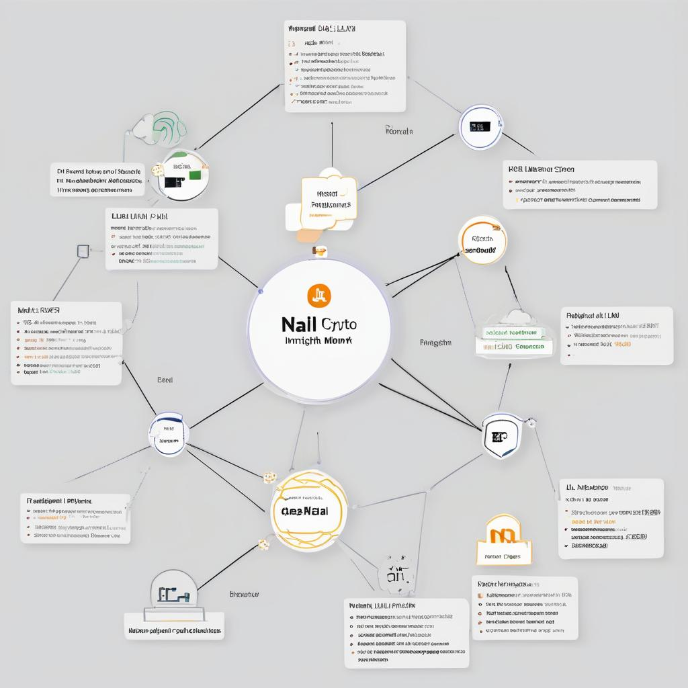

### Project Plan for NALLI: A Network-Agnostic, LLM-Integrated Crypto Monitor  
_by Martin O., The Architect, mart@ibrain.one_   
_January 2024_  

#### Project Name: AI-Enhanced Crypto Insight Tool

#### Objective
Create a minimal yet extensible tool that monitors blockchain transactions across different networks, using a local LLM to analyze data and provide insights.

#### Plan Overview

1. **Preparation and Environment Setup (1 hour)**
   - **Task**: Set up a development environment. Ensure you have the necessary tools and libraries for blockchain API interactions and LLM integration.
   - **Outcome**: A ready development environment with all required tools.

2. **Network Agnosticism (1 hour)**
   - **Task**: Develop a modular approach to interact with different blockchain networks. This might involve creating a configuration file or a set of interfaces to easily switch or add new networks.
   - **Outcome**: A framework capable of interfacing with multiple blockchains.

3. **Transaction Monitoring Module (2 hours)**
   - **Task**: Build a module to fetch and filter transactions from the blockchain. Transactions should be fetched in real-time and filtered based on a predefined criterion (like volume or value).
   - **Outcome**: A working module that monitors blockchain transactions.

4. **LLM Integration for Analysis (2 hours)**
   - **Task**: Integrate your local LLM to process the fetched transactions. Create a function that sends transaction data to the LLM and receives insights.
   - **Outcome**: LLM effectively analyzes transactions and provides insights.

5. **Insight Query Function (1 hour)**
   - **Task**: Develop a function that queries your LLM with specific, structured questions about the transaction data to derive meaningful insights.
   - **Outcome**: Ability to ask the LLM specific questions and receive analysis.

6. **Notification System (1 hour)**
   - **Task**: Implement a simple notification mechanism that triggers based on LLM insights, alerting you to significant market movements or opportunities.
   - **Outcome**: Functional notification system based on LLM feedback.

7. **Basic Testing and Refinement (1 hour)**
   - **Task**: Test the complete system to ensure all components work seamlessly together and the LLM provides relevant insights.
   - **Outcome**: Confirmation that the system operates correctly.

#### Total Estimated Time: ~9 hours

### Key Considerations

- **Modularity**: Ensure each component (network interaction, LLM integration, notification) is modular for easy adaptation or expansion.
- **LLM Utilization**: Leverage the LLM's natural language understanding for efficient and insightful analysis of transaction data.
- **Flexibility**: The system should be flexible enough to add new networks or adjust parameters without significant rework.
- **Security and Reliability**: Ensure secure handling of data and reliable LLM interactions, especially considering real-time data processing.
