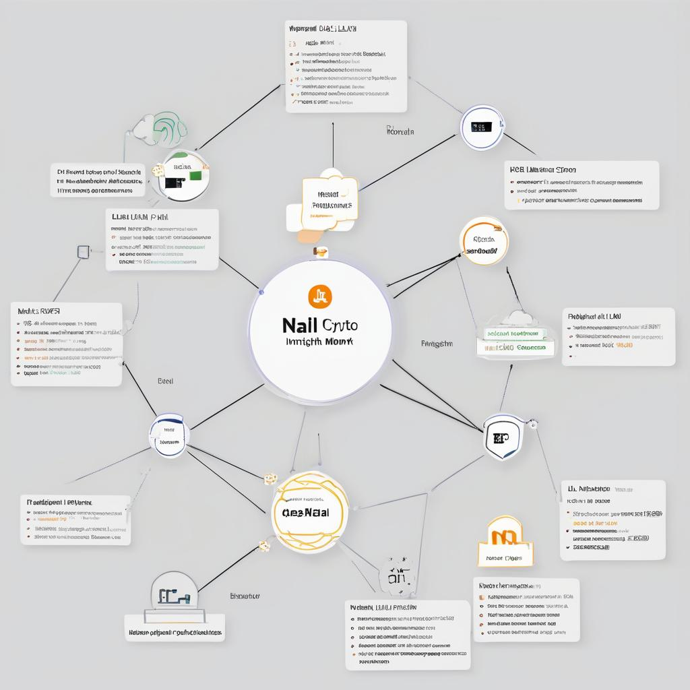

  

### Plan de Projet pour NALLI : Un Moniteur Crypto Intégré à LLM et Agnostique au Réseau
_par Martin O., L'Architecte, mart@ibrain.one_   
_Janvier 2024_

#### Nom du Projet : Outil d'Insight Crypto Amélioré par IA

#### Objectif
Créer un outil minimal mais extensible qui surveille les transactions blockchain à travers différents réseaux, en utilisant un LLM local pour analyser les données et fournir des insights.

#### Vue d'Ensemble du Plan

1. **Préparation et Configuration de l'Environnement (1 heure)**
   - **Tâche** : Mettre en place un environnement de développement. Assurer la disponibilité des outils et des bibliothèques nécessaires pour les interactions API blockchain et l'intégration LLM.
   - **Résultat** : Un environnement de développement prêt avec tous les outils requis.

2. **Agnosticisme Réseau (1 heure)**
   - **Tâche** : Développer une approche modulaire pour interagir avec différents réseaux blockchain. Cela pourrait impliquer la création d'un fichier de configuration ou d'un ensemble d'interfaces pour changer ou ajouter facilement de nouveaux réseaux.
   - **Résultat** : Un cadre capable d'interfacer avec plusieurs blockchains.

3. **Module de Surveillance des Transactions (2 heures)**
   - **Tâche** : Construire un module pour récupérer et filtrer les transactions de la blockchain. Les transactions doivent être récupérées en temps réel et filtrées sur la base d'un critère prédéfini (comme le volume ou la valeur).
   - **Résultat** : Un module fonctionnel qui surveille les transactions blockchain.

4. **Intégration LLM pour l'Analyse (2 heures)**
   - **Tâche** : Intégrer votre LLM local pour traiter les transactions récupérées. Créer une fonction qui envoie les données de transaction au LLM et reçoit des insights.
   - **Résultat** : LLM analyse efficacement les transactions et fournit des insights.

5. **Fonction de Requête d'Insight (1 heure)**
   - **Tâche** : Développer une fonction qui interroge votre LLM avec des questions spécifiques et structurées sur les données de transaction pour obtenir des insights significatifs.
   - **Résultat** : Capacité à poser des questions spécifiques au LLM et recevoir une analyse.

6. **Système de Notification (1 heure)**
   - **Tâche** : Mettre en place un mécanisme de notification simple qui se déclenche sur la base des insights du LLM, vous alertant des mouvements de marché importants ou des opportunités.
   - **Résultat** : Système de notification fonctionnel basé sur les retours du LLM.

7. **Tests de Base et Affinement (1 heure)**
   - **Tâche** : Tester le système complet pour assurer que tous les composants fonctionnent ensemble de manière transparente et que le LLM fournit des insights pertinents.
   - **Résultat** : Confirmation que le système fonctionne correctement.

#### Temps Estimé Total : ~9 heures

### Considérations Clés

- **Modularité** : Assurer que chaque composant (interaction réseau, intégration LLM, notification) soit modulaire pour une adaptation ou une expansion facile.
- **Utilisation du LLM** : Tirer parti de la compréhension du langage naturel du LLM pour une analyse efficace et perspicace des données de transaction.
- **Flexibilité** : Le système doit être suffisamment flexible pour ajouter de nouveaux réseaux ou ajuster les paramètres sans retravailler de manière significative.
- **Sécurité et Fiabilité** : Assurer une gestion sécurisée des données et des interactions fiables avec le LLM, surtout en tenant compte du traitement des données en temps réel.

---